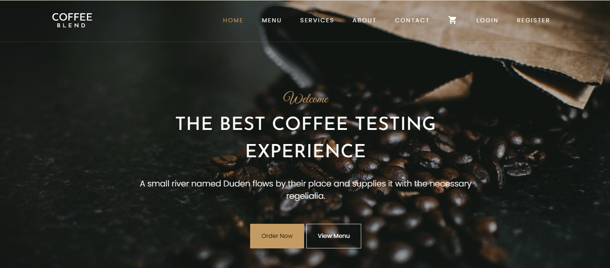

# Coffee Shop Inventory Management System

*A web-based platform designed to simplify and optimize the operations of coffee shops through efficient inventory and sales management.*

---

## **Table of Contents**
- [Introduction](#introduction)
- [The Story](#the-story)
- [Getting Started](#getting-started)
  - [Prerequisites](#prerequisites)
  - [Installation](#installation)
- [Screenshots](#screenshots)
- [Features](#features)
  - [User Authentication](#user-authentication)
  - [Inventory Management](#inventory-management)
  - [Sales Tracking](#sales-tracking)
  - [Reporting & Analytics](#reporting--analytics)
- [Built With](#built-with)
- [API Endpoints](#api-endpoints)
- [Future Enhancements](#future-enhancements)
- [Authors](#authors)
- [Acknowledgments](#acknowledgments)

---

## **Introduction**
The Coffee Shop Inventory Management System helps coffee shop owners manage their inventory, track sales, and generate analytics reports. This project simplifies daily tasks and improves efficiency in small coffee shops by providing a simple and user-friendly interface.

---

## **The Story**
This project was inspired by the growing need for small businesses, especially coffee shops, to better organize their operations. The idea was conceived after realizing how crucial inventory management is for these shops. The system started as a basic order and inventory tracker but evolved into a more robust solution, with user authentication, reporting features, and sales analytics.

---

## **Getting Started**

### **Prerequisites**
To run this project locally, you will need:
- Node.js (v14+)
- MongoDB (or MongoDB Atlas for cloud storage)
- Git

### **Installation**
1. Clone the repository:
   ```bash
   git clone https://github.com/eskadimasmelaku/MVP-portfolio-Coffee-Management-system.git

### **Navigate to the project directory:**
2. cd coffee-inventory-management
3. Install dependencies for both frontend and backend:
4. cd backend
5. npm install
6. cd ../frontend
7. npm install
8. Start the backend server:
9. npm start
10. Start the frontend:
cd ../frontend
npm start
11. Access the system on localhost:3000 via a browser.
### **Screenshots**
### **Dashboard View**


### **Features**
### **User Authentication**
  -OAuth login via GitHub for secure authentication.
  -JWT token-based authentication to ensure user sessions are secure.
### **Inventory Management**
-Easily add, edit, or delete products from the inventory.
-Automatically updates stock levels after sales.
-Alerts for low-stock items, ensuring that the shop is always stocked.
### **Sales Tracking**
-Add customer orders with product details and calculate total sales in real-time.
-Option to view previous sales history and track order progress.
### **Reporting & Analytics**
-Visualize sales data through charts and graphs.
-Generate daily, weekly, and monthly sales reports.
-Export reports as CSV files.
### **Built With**
*Frontend: React.js, Redux for state management, Material-UI for design components.
*Backend: Node.js with Express for RESTful API development.
*Database: MongoDB for storing inventory, sales, and user information.
*Authentication: JSON Web Token (JWT) and GitHub OAuth.
*Deployment: Hosted on AWS EC2 with Nginx for load balancing.
### **API Endpoints**
Inventory Management:
1. GET /inventory: Retrieve all inventory items.
2. POST /inventory: Add a new inventory item.
3. PUT /inventory/:id: Update an existing item.
4. DELETE /inventory/:id: Remove an item from inventory.
Sales Tracking:

1. GET /sales: Get a list of all sales.
2. POST /sales: Record a new sale.
3. GET /sales/:id: Get details of a specific sale.
User Authentication:

1. POST /auth/login: Login with GitHub OAuth.
2. POST /auth/logout: Logout from the system.
### **Future Enhancements**
Mobile Application: Develop a mobile app to allow shop owners to manage inventory and sales on the go.
Predictive Analytics: Use machine learning to predict inventory shortages based on sales trends.
Payment Gateway: Integrate with Stripe or PayPal to manage sales transactions within the system.
Multilingual Support: Add support for multiple languages to cater to a global user base.
## **Authors**
- **Eskadimas Melaku** – [LinkedIn](https://www.linkedin.com/in/eskadimas-melaku-eyuas/)

## **Acknowledgments**
A huge thank you to the coffee shop owners who provided their valuable feedback and insights during the planning phase.
Special thanks to my peers and mentors who helped in testing and improving the system throughout the development cycle.


